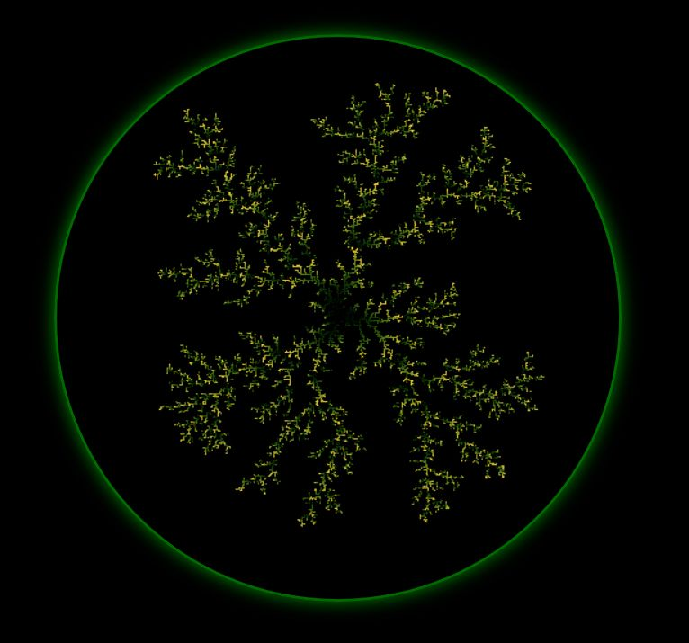

# Diffusion Limited Aggregation

This repository creates a random diffusion limited aggregation in HTML5. See the published page [here](https://rschifini.github.io/Diffusion-Limited-Aggregation/).

The DLA is grown in blocks and the points vary in transparency and color according to its order in the block.

